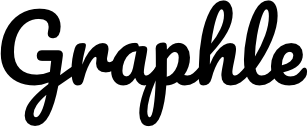

 

 

Graphle is a service build to make learning easy for autistic students. It takes in real time input from the teacher, and arranges it in a visual manner

<h2 align="center">Research</h2>
 

 

<h2 align="center">Solution - Workflow</h2>
 

 - An android app which captures speech of the teacher/instructor and converts it to text and sends it to our backend
  - The text is processed and converted into images using Neural Networs(Generative adversarial network)
  - The generated images are shown to the smart screen in the classroom or to the induvidual screen of the student(Remote Classroom).(Sessions can be viewed on our website)

 

 
 
 
 

 

<h2 align="center">Neural Network Architecture</h2>
 

[Reference](https://openaccess.thecvf.com/content_cvpr_2018/papers/Xu_AttnGAN_Fine-Grained_Text_CVPR_2018_paper.pdf)

<h2 align="center">Workflow</h2>
 

<h2 align="center">Tech Stacks</h2>
 

