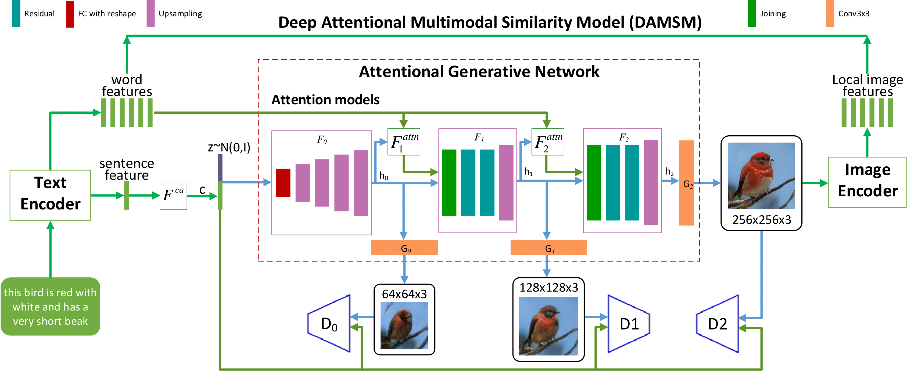

# Graphle

### Graphle is a tool to help children with autism to learn in a better way by visualizing content.

## Problem statement
 - 1 in every 54 children is reported to have autism and these children find it hard to understand complex statements or instructions in their education.
 - Children with autism have amazing visual understanding capabilities and our project aims to make the long complicated statments into visual content to help children with autism learn in a better way

## Research 
 - It is estimated that over 11 million kids have autism and 75 % of them face problems in learning and schooling
 - 95 % of those kids don't like school or are treated badly or bullied
 - After extensive research on methods to teach autistic children, it is evident that visual content and visual representation is the best way to teach the children.

## Solution - Workflow

  - An android app which captures speech of the teacher/instructor and converts it to text and sends it to our backend
  - The text is processed and converted into images using Neural Networs(Generative adversarial network)
  - The generated images are shown to the smart screen in the classroom or to the induvidual screen of the student(Remote Classroom).(Sessions can be viewed on our website)

 

## Neural Network Architecture
[Reference](https://openaccess.thecvf.com/content_cvpr_2018/papers/Xu_AttnGAN_Fine-Grained_Text_CVPR_2018_paper.pdf)

## Screenshots

